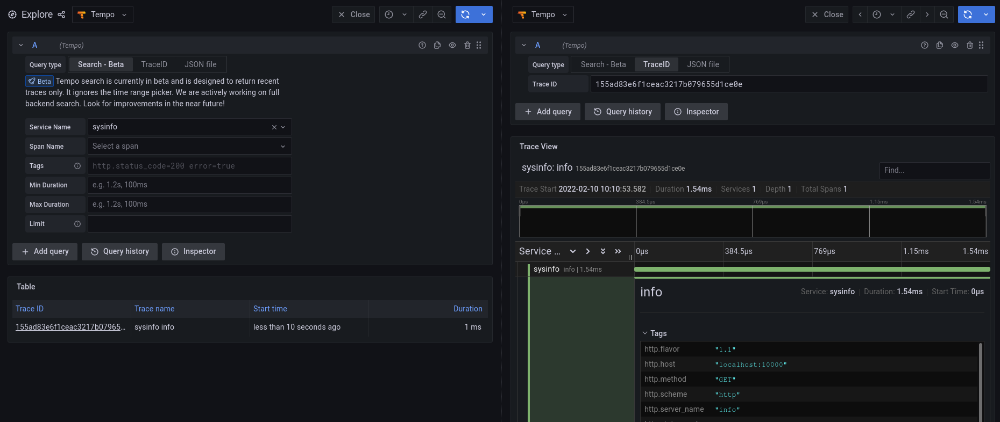

# OpenTelemetry Sandbox
This repo contains configuration to standup a full stack for receiving OpenTelemetry data.

# Usage
There are two ways to launch the full stack: Docker and Kubernetes

## Docker
To launch a local stack using Docker, run `docker compose up` from within the `docker` directory.

## Kubernetes
To launch a standalone mode stack using Kubernetes, run `kubectl apply -f stack.yaml` from within the `k8s` directory.

Note: this is a single deployment that is fully contained. For a production deployment, you will want to
split these out into their own deployments / services.

# Components

## InfluxDB
This is an InfluxDB instance for viewing metric data.

## Telegraf
Telegraf is an agent for pipelines. This instance is configured to receive OTLP data and export
to the InfluxDB instance.

## Prometheus
A Prometheus instance is configured to receive Metric data from the OpenTelemetry collector.

## Tempo
A Grafana Tempo instance is configured to receive Trace data. It also has search enabled
and publishes its HTTP API for Grafana to query.

## Grafana
Grafana is launched to visualize Metric and Trace data. Data sources can be added
for the above InfluxDB, Prometheus, and Tempo as desired.

## OpenTelemetry Collector
This is the main Open Telemetry collector. It exposes GRPC and HTTP receivers. It is
configured to export data to Tempo, Telegraf, and Prometheus.
